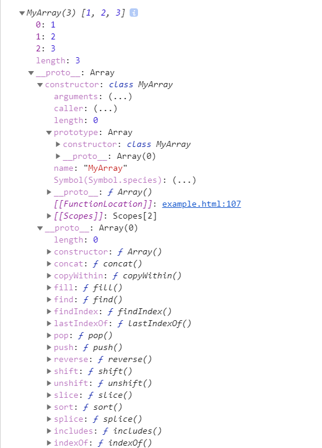

# 1. es6简介

## 1.1 什么是source map文件

* JavaScript脚本正变得越来越复杂。大部分源码（尤其是各种函数库和框架）都要经过转换，才能投入生产环境。

> 压缩，减小体积。比如jQuery 1.9的源码，压缩前是252KB，压缩后是32KB。
>
> 多个文件合并，减少HTTP请求数。
>
> 其他语言编译成JavaScript。最常见的例子就是CoffeeScript。
>
> 这三种情况，都使得实际运行的代码不同于开发代码，除错（debug）变得困难重重。
>
> 通常，JavaScript的解释器会告诉你，第几行第几列代码出错。但是，这对于转换后的代码毫无用处。举例来说，jQuery 1.9压缩后只有3行，每行3万个字符，所有内部变量都改了名字。你看着报错信息，感到毫无头绪，根本不知道它所对应的原始位置。
>
> 这就是Source map想要解决的问题。
>
> 简单说，Source map就是一个信息文件，里面储存着位置信息。也就是说，转换后的代码的每一个位置，所对应的转换前的位置。
>
> 有了它，出错的时候，除错工具将直接显示原始代码，而不是转换后的代码。

## 1.2 什么是repl环境，==读取-求值-输出== 循环，也指命令行交互模式

# 2. let和const命令

```js
//1. let具备块级作用域，同时对于for循环，设置循环变量那一部分是父级作用域，循环体是单独的子作用域
//2. let声明的变量一定要在声明后使用，因为他不存在var发生变量提升（可以在声明前使用，值为undefined）
for (let i = 0; i < 3; i++) {
  let i = 'abc';
  console.log(i);
}
// abc
// abc
// abc

// 3. 块级作用域中的tmp不受外部的tmp影响
var tmp = 123;
if (true) {
    tmp = 'abc'; // ReferenceError
    let tmp;
}

// 4. TDZ(暂时性死区)
if (true) {
  // TDZ开始
  tmp = 'abc'; // ReferenceError
  console.log(tmp); // ReferenceError

  let tmp; // TDZ结束
  console.log(tmp); // undefined

  tmp = 123;
  console.log(tmp); // 123
}
```

## 2.1 暂时性死区

* 只要块级作用域内存在`let`命令，它所声明的变量就“绑定”（binding）这个区域，不再受外部的影响
* 如果区块中存在`let`和`const`命令，这个区块对这些命令声明的变量，从一开始就形成了封闭作用域（不受外部的影响）。凡是在声明之前就使用这些变量，就会报错。
* 总之，在代码块内，使用`let`命令声明变量之前，该变量都是不可用的。这在语法上，称为“暂时性死区”

## 2.2 变量提升

```js
if (true) {
    console.log(tmp); // undefined,因为tmp被提升了相当于在打印前执行了var tmp = undefined操作
    var tmp;
}
```

## 2.3 块级作用域

```js
var tmp = new Date();

function f() {
  console.log(tmp);
  if (false) {
    var tmp = 'hello world';
  }
}

f(); // undefined,因为var存在函数作用域，在函数f中，存在一个tmp的变量声明，同时，由于变量提升（函数内部的变量提升）导致内部中的tmp可以不声明就使用，结果出现undefined
```

* 没有块级作用域之前，想要解决var变量全局泄漏的问题需要用到匿名立即执行函数表达式

```js
// IIFE 写法
(function () {
  var tmp = ...;
  ...
}());

// 块级作用域写法
{
  let tmp = ...;
  ...
}
```

* 块级作用域中进行函数声明

> 1. 允许在块级作用域内声明函数。
> 2. 函数声明类似于`var`，即会提升到全局作用域或函数作用域的头部。
> 3. 同时，函数声明还会提升到所在的块级作用域的头部。

```js
// 浏览器的 ES6 环境
function f() { console.log('I am outside!'); }

(function () {
  if (false) {
    // 重复声明一次函数f
    function f() { console.log('I am inside!'); }
  }

  f();
}());
// Uncaught TypeError: f is not a function

// 上面的代码实际行为类似于下面

// 浏览器的 ES6 环境
function f() { console.log('I am outside!'); }
(function () {
  var f = undefined;
  if (false) {
    function f() { console.log('I am inside!'); }
  }

  f();
}());
// Uncaught TypeError: f is not a function
```

* 考虑到环境导致的行为差异太大，应该避免在块级作用域内声明函数。如果确实需要，也应该写成函数表达式，而不是函数声明语句。

```js
// 块级作用域内部的函数声明语句，建议不要使用
{
  let a = 'secret';
  function f() {
    return a;
  }
}

// 块级作用域内部，优先使用函数表达式
{
  let a = 'secret';
  let f = function () {
    return a;
  };
}
```

## 2.4 let和const声明的变量不能重复声明

## 2.5 const的一些注意事项（因为很多特性都跟let一样）

* `const`实际上保证的，并不是变量的值不得改动，而是变量指向的那个内存地址所保存的数据不得改动。对于简单类型的数据（数值、字符串、布尔值），值就保存在变量指向的那个内存地址，因此等同于常量。但对于复合类型的数据（主要是对象和数组），变量指向的内存地址，保存的只是一个指向实际数据的指针，`const`只能保证这个指针是固定的（即总是指向另一个固定的地址），至于它指向的数据结构是不是可变的，就完全不能控制了。因此，将一个对象声明为常量必须非常小心。
* 若真想将对象冻结，使用`Object.freeze`，冻结的只是基本数据类型的属性

```js
const foo = Object.freeze({});

// 常规模式时，下面一行不起作用；
// 严格模式时，该行会报错
foo.prop = 123;
```

* 彻底的冻结

```js
var constantize = (obj) => {
  Object.freeze(obj);
  Object.keys(obj).forEach( (key, i) => {
    if ( typeof obj[key] === 'object' ) {
      constantize( obj[key] );
    }
  });
};
```

## 2.6 ES6声明变量的六种方法

* ES5 只有两种声明变量的方法：`var`命令和`function`命令。ES6 除了添加`let`和`const`命令，后面章节还会提到，另外两种声明变量的方法：`import`命令和`class`命令。所以，ES6 一共有 6 种声明变量的方法。

## 2.7 顶层对象的属性

* `var`命令和`function`命令声明的全局变量，依旧是顶层对象的属性；另一方面规定，`let`命令、`const`命令、`class`命令声明的全局变量，不属于顶层对象的属性。

```js
var a = 1;
// 如果在 Node 的 REPL 环境，可以写成 global.a
// 或者采用通用方法，写成 this.a
window.a // 1

let b = 1;
window.b // undefined
```

* 不管是严格模式，还是普通模式，`new Function('return this')()`，总是会返回全局对象。但是，如果浏览器用了 CSP（Content Security Policy，内容安全策略），那么`eval`、`new Function`这些方法都可能无法使用。

```js
const geval = eval;
function Test () {
    console.log(this);                                  // Test
    function c() {
        console.log(this);                                // window
    }
    c();

    this.test = new Function('console.log(this);')();  // window
    this.test1 = geval('console.log(this)');           // window
    this.test2 = eval('console.log(this)');            // Test
    this.test3 = function () {
        console.log(this);                               // window
    }();
    this.test4 = function () {
        console.log(this);
    };
    this.test5 = new Function('console.log(this);');
}
var test = new Test();
console.log(test.test4());                          // Test
console.log(test.test5());                          // Test
```

# 3. 变量的解构赋值

## 3.1 数组的解构赋值

> 事实上，只要某种数据结构具有 Iterator 接口，也就是symbol.iterator属性（目的还不是生成一个遍历器对象），都可以采用数组形式的解构赋值。
>
> ```js
> function* fibs() {
> let a = 0;
> let b = 1;
> while (true) {
>  yield a;
>  [a, b] = [b, a + b];
> }
> }
> // 返回的就是一个Iterotor对象
> let [first, second, third, fourth, fifth, sixth] = fibs();
> sixth // 5
> ```
>
> ```js
> let [x = 1, y = x] = [];     // x=1; y=1
> let [x = 1, y = x] = [2];    // x=2; y=2
> let [x = 1, y = x] = [1, 2]; // x=1; y=2
> let [x = y, y = 1] = [];     // ReferenceError: y is not defined
> 
> let [x = 1] = [undefined];
> x // 1
> 
> let [x = 1] = [null];
> x // null
> 
> let [foo = true] = [];
> foo // true
> 
> let [x, y = 'b'] = ['a']; // x='a', y='b'
> let [x, y = 'b'] = ['a', undefined]; // x='a', y='b'
> ```

## 3.2 对象的解构赋值

```js
// ==================================================================================================
// 1. 
let { foo, bar } = { foo: 'aaa', bar: 'bbb' };
foo // "aaa"
bar // "bbb"

// ==================================================================================================
// 2. 
let { bar, foo } = { foo: 'aaa', bar: 'bbb' };
foo // "aaa"
bar // "bbb"

let { baz } = { foo: 'aaa', bar: 'bbb' };
baz // undefined

// ==================================================================================================
// 3. 
let {foo} = {bar: 'baz'};
foo // undefined

// ==================================================================================================
// 4. 
// 例一
let { log, sin, cos } = Math;

// 例二
const { log } = console;
log('hello') // hello

// ==================================================================================================
// 5. 
let { foo: baz } = { foo: 'aaa', bar: 'bbb' };
baz // "aaa"

let obj = { first: 'hello', last: 'world' };
let { first: f, last: l } = obj;
f // 'hello'
l // 'world'

// ==================================================================================================
// 6. 
let { foo: foo, bar: bar } = { foo: 'aaa', bar: 'bbb' };
let { foo: baz } = { foo: 'aaa', bar: 'bbb' };
baz // "aaa"
foo // error: foo is not defined

// ==================================================================================================
// 7. 
let obj = {
  p: [
    'Hello',
    { y: 'World' }
  ]
};

let { p: [x, { y }] } = obj;
x // "Hello"
y // "World"

let obj = {
  p: [
    'Hello',
    { y: 'World' }
  ]
};

let { p, p: [x, { y }] } = obj;
x // "Hello"
y // "World"
p // ["Hello", {y: "World"}]

const node = {
  loc: {
    start: {
      line: 1,
      column: 5
    }
  }
};

let { loc, loc: { start }, loc: { start: { line }} } = node;
line // 1
loc  // Object {start: Object}
start // Object {line: 1, column: 5}

// ==================================================================================================
// 8. 对象的解构赋值可以取到继承的属性
const obj1 = {};
const obj2 = { foo: 'bar' };
// Object是Function的实例化对象，所以Object._proto_指向Function.prototype,然后Function.prototype._proto_指向Object.prototype(其中含有setPrototypeOf方法)，这就是下面能取到setPrototypeOf方法的过程（实际是原型链）
Object.setPrototypeOf(obj1, obj2);

const { foo } = obj1;
foo // "bar"

// ==================================================================================================
// 9. 由于数组本质是特殊的对象，因此可以对数组进行对象属性的解构。
let arr = [1, 2, 3];
// [arr.length - 1]就是2键，对应的值是3。方括号这种写法，属于“属性名表达式”
let {0 : first, [arr.length - 1] : last} = arr;
first // 1
last // 3
```

## 3.3 字符串的解构赋值

```js
// 1. 字符串也可以解构赋值。这是因为此时，字符串被转换成了一个类似数组的对象。
const [a, b, c, d, e] = 'hello';
a // "h"
b // "e"
c // "l"
d // "l"
e // "o"
// 类似数组的对象都有一个length属性，因此还可以对这个属性解构赋值。
let {length : len} = 'hello';
len // 5

```

## 3.4 数值和布尔值的解构赋值

```js
// 解构赋值时，如果等号右边是数值和布尔值，则会先转为对象。
let {toString: s} = 123;
s === Number.prototype.toString // true

let {toString: s} = true;
s === Boolean.prototype.toString // true
```

## 3.5 函数参数的解构赋值

```js
// 1. 
[[1, 2], [3, 4]].map(([a, b]) => a + b);
// [ 3, 7 ]

[1, undefined, 3].map((x = 'yes') => x);
// [ 1, 'yes', 3 ]

// 2. 函数参数的解构也可以使用默认值。
function move({x = 0, y = 0} = {}) {
  return [x, y];
}

move({x: 3, y: 8}); // [3, 8]
move({x: 3}); // [3, 0]
move({}); // [0, 0]
move(); // [0, 0]

function move({x, y} = { x: 0, y: 0 }) {
  return [x, y];
}

move({x: 3, y: 8}); // [3, 8]
move({x: 3}); // [3, undefined]
move({}); // [undefined, undefined]
move(); // [0, 0]

// 3. 
```


# 4. Generator函数的语法

## 4.1 基本概念

> Generator 函数是 ES6 提供的一种异步编程解决方案，语法行为与传统函数完全不同。
>
> Generator 函数有多种理解角度。语法上，首先可以把它理解成，Generator 函数是一个状态机，封装了多个内部状态。
>
> 执行 Generator 函数会返回一个遍历器对象，也就是说，Generator 函数除了状态机，还是一个遍历器对象生成函数。返回的遍历器对象，可以依次遍历 Generator 函数内部的每一个状态。
>
> 形式上，Generator 函数是一个普通函数，但是有两个特征。一是，`function`关键字与函数名之间有一个星号；二是，函数体内部使用`yield`表达式，定义不同的内部状态（`yield`在英语里的意思就是“产出”）。
>
> 说了这么多，上代码
>
> ```js
> function* helloWorldGenerator() {
>   yield 'hello';
>   yield 'world';
>   return 'ending';
> }
> 
> // 该函数并不执行，返回的也不是函数运行结果，而是一个指向内部状态的指针对象，也就是遍历器对象（Iterator）
> var hw = helloWorldGenerator();
> 
> hw.next()
> // { value: 'hello', done: false }
> 
> hw.next()
> // { value: 'world', done: false }
> 
> hw.next()
> // { value: 'ending', done: true }
> 
> hw.next()
> // { value: undefined, done: true }
> ```
>
> 总结一下，调用 Generator 函数，返回一个遍历器对象，代表 Generator 函数的内部指针。以后，每次调用遍历器对象的`next`方法，就会返回一个有着`value`和`done`两个属性的对象。`value`属性表示当前的内部状态的值，是`yield`表达式后面那个表达式的值；`done`属性是一个布尔值，表示是否遍历结束。

## 4.2 yield表达式

> 遍历器对象的`next`方法的运行逻辑如下。
>
> （1）遇到`yield`表达式，就暂停执行后面的操作，并将紧跟在`yield`后面的那个表达式的值，作为返回的对象的`value`属性值。
>
> （2）下一次调用`next`方法时，再继续往下执行，直到遇到下一个`yield`表达式。
>
> （3）如果没有再遇到新的`yield`表达式，就一直运行到函数结束，直到`return`语句为止，并将`return`语句后面的表达式的值，作为返回的对象的`value`属性值。
>
> （4）如果该函数没有`return`语句，则返回的对象的`value`属性值为`undefined`。
>
> 另外需要注意，`yield`表达式只能用在 Generator 函数里面，用在其他地方都会报错。

* 另外需要注意，`yield`表达式只能用在 Generator 函数里面，用在其他地方都会报错。

```js
var arr = [1, [[2, 3], 4], [5, 6]];

var flat = function* (a) {
  a.forEach(function (item) {
    if (typeof item !== 'number') {
      yield* flat(item);
    } else {
      yield item;
    }
  });
};

for (var f of flat(arr)){
  console.log(f);
}
// 会报错，因为yield只可放在generator函数中
```

## 4.3 next方法的参数

`yield`表达式本身没有返回值，或者说总是返回`undefined`。`next`方法可以带一个参数，该参数就会被当作上一个`yield`表达式的返回值。

```js
function* f() {
  for(var i = 0; true; i++) {
    var reset = yield i;
    if(reset) { i = -1; }
  }
}

var g = f();

g.next() // { value: 0, done: false }
g.next() // { value: 1, done: false }
g.next(true) // { value: 0, done: false }
```

再看一个例子。

```js
function* foo(x) {
  var y = 2 * (yield (x + 1));
  var z = yield (y / 3);
  return (x + y + z);
}

var a = foo(5);
a.next() // Object{value:6, done:false}
a.next() // Object{value:NaN, done:false}
a.next() // Object{value:NaN, done:true}

var b = foo(5);
b.next() // { value:6, done:false }
b.next(12) // { value:8, done:false }
b.next(13) // { value:42, done:true }
```

如果向`next`方法提供参数，返回结果就完全不一样了。上面代码第一次调用`b`的`next`方法时，返回`x+1`的值`6`；第二次调用`next`方法，将上一次`yield`表达式的值设为`12`，因此`y`等于`24`，返回`y / 3`的值`8`；第三次调用`next`方法，将上一次`yield`表达式的值设为`13`，因此`z`等于`13`，这时`x`等于`5`，`y`等于`24`，所以`return`语句的值等于`42`。

再看一个通过`next`方法的参数，向 Generator 函数内部输入值的例子。

```js
function* dataConsumer() {
  console.log('Started');
  console.log(`1. ${yield}`);
  console.log(`2. ${yield}`);
  return 'result';
}

let genObj = dataConsumer();
genObj.next();
// Started
genObj.next('a')
// 1. a
genObj.next('b')
// 2. b
```

如果想要第一次调用`next`方法时，就能够输入值，可以在 Generator 函数外面再包一层。

```js
function wrapper(generatorFunction) {
  return function (...args) {
    let generatorObject = generatorFunction(...args);
    generatorObject.next();
    return generatorObject;
  };
}

const wrapped = wrapper(function* () {
  console.log(`First input: ${yield}`);
  return 'DONE';
});

wrapped().next('hello!')
// First input: hello!
```

## 4.4 for...of 循环

```js
function* foo() {
  yield 1;
  yield 2;
  yield 3;
  yield 4;
  yield 5;
  return 6; // 注意，这里的返回是{value:6,done:true}
}

for (let v of foo()) {
  console.log(v);
}
// 1 2 3 4 5
```

上面代码使用`for...of`循环，依次显示 5 个`yield`表达式的值。这里需要注意，一旦`next`方法的返回对象的`done`属性为`true`，`for...of`循环就会中止，且不包含该返回对象，所以上面代码的`return`语句返回的`6`，不包括在`for...of`循环之中。

除了`for...of`循环以外，扩展运算符（`...`）、解构赋值和`Array.from`方法内部调用的，都是遍历器接口。这意味着，它们都可以将 Generator 函数返回的 Iterator 对象，作为参数。

```javascript
function* numbers () {
  yield 1
  yield 2
  return 3  
  yield 4
}

// 扩展运算符
[...numbers()] // [1, 2]  ，因为done为true的对象的value不会取

// Array.from 方法
Array.from(numbers()) // [1, 2]

// 解构赋值
let [x, y] = numbers();
x // 1
y // 2

// for...of 循环
for (let n of numbers()) {
  console.log(n)
}
// 1
// 2
```

## 4.5 yield* 表达式

```js
function* foo() {
  yield 'a';
  yield 'b';
}
function* bar() {
  yield 'x';
  yield* foo();
  yield 'y';
}

// 等同于
function* bar() {
  yield 'x';
  yield 'a';
  yield 'b';
  yield 'y';
}

// 等同于
function* bar() {
  yield 'x';
  for (let v of foo()) {
    yield v;
  }
  yield 'y';
}

for (let v of bar()){
  console.log(v);
}
// "x"
// "a"
// "b"
// "y"
```

再来看几个例子。

```js
function* inner() {
  yield 'hello!';
}

function* outer1() {
  yield 'open';
  yield inner();
  yield 'close';
}

var gen = outer1()
gen.next().value // "open"
gen.next().value // 返回一个遍历器对象
gen.next().value // "close"

function* outer2() {
  yield 'open'
  yield* inner()
  yield 'close'
}

var gen = outer2()
gen.next().value // "open"
gen.next().value // "hello!"
gen.next().value // "close"
```

```js
let read = (function* () {
  yield 'hello';
  yield* 'hello';
})();

read.next().value // "hello"
read.next().value // "h"

function* gen(){
  yield* ["a", "b", "c"];
}

gen().next() // { value:"a", done:false }
```

```js
// 1. 
function* foo() {
  yield 2;
  yield 3;
  return "foo";
}

function* bar() {
  yield 1;
  var v = yield* foo();
  console.log("v: " + v);
  yield 4;
}

var it = bar();

it.next()
// {value: 1, done: false}
it.next()
// {value: 2, done: false}
it.next()
// {value: 3, done: false}
it.next();
// "v: foo"
// {value: 4, done: false}
it.next()
// {value: undefined, done: true}

// 2. 
function* genFuncWithReturn() {
  yield 'a';
  yield 'b';
  return 'The result';
}
function* logReturned(genObj) {
  let result = yield* genObj;
  console.log(result);
}

[...logReturned(genFuncWithReturn())]
// The result
// 值为 [ 'a', 'b' ]
```

```js
function* iterTree(tree) {
  if (Array.isArray(tree)) {
    for(let i=0; i < tree.length; i++) {
      yield* iterTree(tree[i]);
    }
  } else {
    yield tree;
  }
}

const tree = [ 'a', ['b', 'c'], ['d', 'e'] ];

for(let x of iterTree(tree)) {
  console.log(x);
}
// a
// b
// c
// d
// e
```

## 4.6 Generator 函数的this

下面代码是很diao的操作，同时在generator函数的prototype上绑定了属性，这样它的实例化对象f就可以访问这些属性

```js
function* gen() {
  this.a = 1;
  yield this.b = 2;
  yield this.c = 3;
}

function F() {
  return gen.call(gen.prototype);
}
// 注意这里的f不是F()的实例化对象，而是gen的实例化对象，因为return返回一个对象，所以将这个对象赋值给了f，而不是this
var f = new F();

f.next();  // Object {value: 2, done: false}
f.next();  // Object {value: 3, done: false}
f.next();  // Object {value: undefined, done: true}

f.a // 1
f.b // 2
f.c // 3
```

## 4.7 Generator 与状态机

```js
// 1. 未使用generator函数
var ticking = true;
var clock = function() {
  if (ticking)
    console.log('Tick!');
  else
    console.log('Tock!');
  ticking = !ticking;
}
// 2. 使用
var clock = function* () {
  while (true) {
    console.log('Tick!');
    yield;
    console.log('Tock!');
    yield;
  }
};
```

## 4.8 Generator 与协程

```js
function delay() {
  setTimeout(() => {
    console.log('delay');

  }, 1000);
}
function* fuck() {
  yield console.log('hello');
  yield delay();
  yield console.log('woeld');
}

let fuckYou = fuck();
fuckYou.next();
fuckYou.next();
fuckYou.next();
console.log('nihao');
// 运行结果
// hello
// woeld
// nihao
// delay
// 因为遇见yield会执行后面的表达式，遇见delay会执行它，但是遇见了setTimeout函数（模拟异步），等delay函数执行完毕，然后返回，然后下一次next，说明什么，说明你要想整体同步执行，那么你的yoeld后的操作也应该是同步操作，当然也有方法可以让异步变成同步，下面这个例子，将.next的调用放在异步操作完成后

function delay() {
  setTimeout(() => {
    console.log('delay');
    fuckYou.next();
  }, 1000);
}
function* fuck() {
  yield console.log('hello');
  yield delay();
  yield console.log('woeld');
}

let fuckYou = fuck();
fuckYou.next();
fuckYou.next();
// fuckYou.next();
console.log('nihao');
```


# 5. Iterator和for...of循环

## 5.1 Iterator的概念

> JavaScript 原有的表示“集合”的数据结构，主要是数组（`Array`）和对象（`Object`），ES6 又添加了`Map`和`Set`。这样就有了四种数据集合
>
> 遍历器（Iterator）就是这样一种机制。它是一种接口，为各种不同的数据结构提供统一的访问机制。任何数据结构只要部署 Iterator 接口，就可以完成遍历操作（即依次处理该数据结构的所有成员）。
>
> Iterator 的作用有三个：一是为各种数据结构，提供一个统一的、简便的访问接口；二是使得数据结构的成员能够按某种次序排列；三是 ES6 创造了一种新的遍历命令`for...of`循环，Iterator 接口主要供`for...of`消费。
>
> Iterator 的遍历过程是这样的。
>
> （1）创建一个指针对象，指向当前数据结构的起始位置。也就是说，遍历器对象本质上，就是一个指针对象。
>
> （2）第一次调用指针对象的`next`方法，可以将指针指向数据结构的第一个成员。
>
> （3）第二次调用指针对象的`next`方法，指针就指向数据结构的第二个成员。
>
> （4）不断调用指针对象的`next`方法，直到它指向数据结构的结束位置。
>
> 模拟next方法：
>
> ```js
> var it = makeIterator(['a', 'b']);
> 
> it.next() // { value: "a", done: false }
> it.next() // { value: "b", done: false }
> it.next() // { value: undefined, done: true }
> 
> function makeIterator(array) {
>   var nextIndex = 0;
>   return {
>     next: function() {
>       return nextIndex < array.length ?
>         {value: array[nextIndex++], done: false} :
>         {value: undefined, done: true};
>     }
>   };
> }
> ```
>
> 

## 5.2 默认Iterator接口

* ES6 规定，默认的 Iterator 接口部署在数据结构的`Symbol.iterator`属性，或者说，一个数据结构只要具有`Symbol.iterator`属性，就可以认为是“可遍历的”
* ES6 的有些数据结构原生具备 Iterator 接口（比如数组），即不用任何处理，就可以被`for...of`循环遍历。原因在于，这些数据结构原生部署了`Symbol.iterator`属性（详见下文），另外一些数据结构没有（比如对象）。凡是部署了`Symbol.iterator`属性的数据结构，就称为部署了遍历器接口。调用这个接口，就会返回一个遍历器对象。
* 原生具备 Iterator 接口的数据结构如下。

> - Array
> - Map
> - Set
> - String
> - TypedArray
> - 函数的 arguments 对象
> - NodeList 对象

* 一个例子

```js
let arr = ['a', 'b', 'c'];
let iter = arr[Symbol.iterator]();

iter.next() // { value: 'a', done: false }
iter.next() // { value: 'b', done: false }
iter.next() // { value: 'c', done: false }
iter.next() // { value: undefined, done: true }
```

* 对于原生部署 Iterator 接口的数据结构，不用自己写遍历器生成函数，`for...of`循环会自动遍历它们。除此之外，其他数据结构（主要是对象）的 Iterator 接口，都需要自己在`Symbol.iterator`属性上面部署，这样才会被`for...of`循环遍历。
* 一个对象如果要具备可被`for...of`循环调用的 Iterator 接口，就必须在`Symbol.iterator`的属性上部署遍历器生成方法（原型链上的对象具有该方法也可）。

```js
class RangeIterator {
  constructor(start, stop) {
    this.value = start;
    this.stop = stop;
  }

  [Symbol.iterator]() { return this; } // 遍历器生成函数，返回一个遍历器，它有next方法，他的next方法中的返回值一定要是 {done: false, value: value}这种格式表示还没有遍历完，{done: true, value: undefined}表示遍历完成

  next() {
    var value = this.value;
    if (value < this.stop) {
      this.value++;
      return {done: false, value: value};
    }
    return {done: true, value: undefined};
  }
}

function range(start, stop) {
  return new RangeIterator(start, stop);
}

for (var v of range(0, 3)) {
  console.log(v); // 0, 1, 2
}
```

```js
function Obj(value) {
  this.value = value;
  this.next = null;
}

Obj.prototype[Symbol.iterator] = function() {
  var iterator = { next: next };

  var current = this;

  function next() {
    // 注意这里的current是对外部作用域中的current的引用（不是复制），所以在这个作用域中对他的修改会引起外部作用域中对应这个变量的修改
    if (current) {
      var value = current.value;
      current = current.next;
      return { done: false, value: value };
    } else {
      return { done: true };
    }
  }
  return iterator;
}

var one = new Obj(1);
var two = new Obj(2);
var three = new Obj(3);

one.next = two;
two.next = three;

for (var i of one){
  console.log(i); // 1, 2, 3
}
```

```js
let obj = {
  data: [ 'hello', 'world' ],
  [Symbol.iterator]() {
    const self = this;
    let index = 0;
    return {
      next() {
        if (index < self.data.length) {
          return {
            value: self.data[index++],
            done: false
          };
        } else {
          return { value: undefined, done: true };
        }
      }
    };
  }
};
```

* 只要一个对象部署了[Symbol.iterator]属性（一个遍历器对象生成函数），那么可以被for-of访问，且能够进行解构赋值操作

## 5.3 调用 Iterator 接口的场合

* **解构赋值**

```js
let set = new Set().add('a').add('b').add('c');

let [x,y] = set;
// x='a'; y='b'

let [first, ...rest] = set;
// first='a'; rest=['b','c'];
```


* **扩展运算符**

```js
// 例一
var str = 'hello';
[...str] //  ['h','e','l','l','o']

// 例二
let arr = ['b', 'c'];
['a', ...arr, 'd']
// ['a', 'b', 'c', 'd']

//实际上，这提供了一种简便机制，可以将任何部署了 Iterator 接口的数据结构，转为数组。也就是说，只要某个数据结构部署了 Iterator 接口，就可以对它使用扩展运算符，将其转为数组。
let arr = [...iterable];
```


* **yield\***

```js
let generator = function* () {
  yield 1;
  yield* [2,3,4];
  yield 5;
};

var iterator = generator();

iterator.next() // { value: 1, done: false }
iterator.next() // { value: 2, done: false }
iterator.next() // { value: 3, done: false }
iterator.next() // { value: 4, done: false }
iterator.next() // { value: 5, done: false }
iterator.next() // { value: undefined, done: true }
```


* **其他场合**

> - for...of
> - Array.from()
> - Map(), Set(), WeakMap(), WeakSet()（比如`new Map([['a',1],['b',2]])`）
> - Promise.all()
> - Promise.race()

## 5.4 字符串的 Iterator 接口

```js
// 默认
var someString = "hi";
typeof someString[Symbol.iterator]
// "function"

var iterator = someString[Symbol.iterator]();

iterator.next()  // { value: "h", done: false }
iterator.next()  // { value: "i", done: false }
iterator.next()  // { value: undefined, done: true }

// 修改
var str = new String("hi");

[...str] // ["h", "i"]

str[Symbol.iterator] = function() {
  return {
    next: function() {
      if (this._first) {
        this._first = false;
        return { value: "bye", done: false };
      } else {
        return { done: true };
      }
    },
    _first: true
  };
};

[...str] // ["bye"]
str // "hi"
```

## 5.5 Iterator 接口与 Generator 函数

```js
let myIterable = {
  [Symbol.iterator]: function* () {
    yield 1;
    yield 2;
    yield 3;
  }
}
[...myIterable] // [1, 2, 3]

// 或者采用下面的简洁写法

let obj = {
  * [Symbol.iterator]() {
    yield 'hello';
    yield 'world';
  }
};

for (let x of obj) {
  console.log(x);
}
// "hello"
// "world"
```

## 5.6 遍历器对象的 return()，throw()

遍历器对象除了具有`next`方法，还可以具有`return`方法和`throw`方法。如果你自己写遍历器对象生成函数，那么`next`方法是必须部署的，`return`方法和`throw`方法是否部署是可选的。

`return`方法的使用场合是，如果`for...of`循环提前退出（通常是因为出错，或者有`break`语句），就会调用`return`方法。如果一个对象在完成遍历前，需要清理或释放资源，就可以部署`return`方法。

## 5.7 for...of 循环

前提：存在Symbol.iterable属性，

`for...of`循环调用遍历器接口，数组的遍历器接口只返回具有数字索引的属性的值。这一点跟`for...in`循环也不一样，for-in是获得属性名（原型链上的所有属性名，前提是属性描述符的enumarable特征为true）。

```js
let arr = [3, 5, 7];
arr.foo = 'hello';

for (let i in arr) {
  console.log(i); // "0", "1", "2", "foo"
}

for (let i of arr) {
  console.log(i); //  "3", "5", "7"
}
```

```js
let arrayLike = { length: 2, 0: 'a', 1: 'b' };

// 报错
for (let x of arrayLike) {
  console.log(x);
}

// 正确,一定要是类似数组对象
for (let x of Array.from(arrayLike)) {
  console.log(x);
}
```

对于普通对象

```js
// 1. 利用Object.keys()返回他的所有键名组成的数组（存在symbol.iterable可以遍历）
for (var key of Object.keys(someObject)) {
  console.log(key + ': ' + someObject[key]);
}
// 2. 使用 Generator 函数将对象重新包装一下
function* entries(obj) {
  for (let key of Object.keys(obj)) {
    yield [key, obj[key]];
  }
}

for (let [key, value] of entries(obj)) {
  console.log(key, '->', value);
}
// a -> 1
// b -> 2
// c -> 3
```


# 6. Symbol

> 小插曲1：`Object.assign()`方法
>
> * 如果目标对象中的属性具有相同的键，则属性将被源对象中的属性覆盖。后面的源对象的属性将类似地覆盖前面的源对象的属性。
> * Object.assign 方法只会拷贝源对象自身的并且可枚举的属性到目标对象。该方法使用源对象的[[Get]]和目标对象的[[Set]]，所以它会调用相关 getter 和 setter。因此，它分配属性，而不仅仅是复制或定义新的属性。如果合并源包含getter，这可能使其不适合将新属性合并到原型中。为了将属性定义（包括其可枚举性）复制到原型，应使用Object.getOwnPropertyDescriptor()和Object.defineProperty() 。
> * String类型和 Symbol 类型的属性都会被拷贝。
> * Object.assign 不会在那些source对象值为 `null`或 `undefined` 的时候抛出错误。
> * 在出现错误的情况下，例如，如果属性不可写，会引发TypeError，如果在引发错误之前添加了任何属性，则可以更改target对象。
> * 针对**深拷贝**，需要使用其他办法，因为 Object.assign()拷贝的是属性值。假如源对象的属性值是一个对象的引用，那么它也只指向那个引用。也就是说，如果对象的属性值为简单类型（如string， number），通过Object.assign({},srcObj);得到的新对象为`深拷贝`；如果属性值为对象或其它引用类型，那对于这个对象而言其实是`浅拷贝`的。
>
> 小插曲2：理解对象
>
> 1. 属性类型（描述对象的属性的各种特征）
>
>    * 数据属性
>
>    > `[[Configurable]]`：表示能否通过delete删除属性从而重新定义属性，能否修改属性的特性，或则能否把属性修改为访问器属性。对于直接在对象上定义的属性，默认为true。
>    >
>    > 
>    >
>    > `[[Enumerable]]`：表示能否通过for-in循环返回属性。对于直接在对象上定义的属性，这个值为true
>    >
>    > 
>    >
>    > `[[Writable]]`：能否修改属性的值。对于直接在对象上定义的属性，该值为true
>    >
>    > 
>    >
>    > `[[Value]]`：包含这个属性的数据值。读取属性值的时候，从这儿读，写入属性值的时候，把新值保存在这个位置。默认为undefined
>    >
>    > 
>    >
>    > 要修改属性默认的特性，必须使用object.defineProperty()
>    >
>    > ```js
>    > // 1. 对象person没有属性的情况下，使用Object.defineProperty定义新属性，若不指定，那么configurable,writable,enumerable都是false
>    > var person = {};
>    > Object.defineProperty(person,"name",{
>    >     writable:false,
>    >     value:'chinbor',
>    > });
>    > // 2. 对象有属性的情况下,默认name的configurable,writable,enumerable都是true
>    > var person = {
>    >     name:'chinbor'
>    > };
>    > Object.defineProperty(person,"name",{
>    >     writable:false,
>    >     value:'chinbor',
>    > });
>    > ```
>    >
>    > 
>
>    
>
>    * 访问器属性
>
>      > `[[Configurable]]`：表示能否通过delete删除属性从而重新定义属性，能否修改属性的特性，或则能否把属性修改为数据属性。对于直接在对象上定义的属性，默认为true。
>      >
>      > 
>      >
>      > `[[Enumerable]]`：表示能否通过for-in循环返回属性。对于直接在对象上定义的属性，这个值为true
>      >
>      > 
>      >
>      > `[[Get]]`：在读取属性时调用的函数，默认值为undefined
>      >
>      > 
>      >
>      > `[[Set]]`：在写入属性时调用的函数。默认为undefined
>      >
>      > 
>      >
>      > 示例代码：
>      >
>      > ```js
>      > var book = {
>      >     _year: 2004,
>      >     edition: 1
>      > };
>      > // 其余的两个特征理应为false
>      > Object.defineProperty(book, 'year', {
>      >    get: function () {
>      >        return this._year;
>      >    },
>      >    set: function (newVlue) {
>      >        if (newVlue > 2004) {
>      >            this._year = 2004;
>      >            this.edition += newValue - 2004;
>      >        }
>      >    }
>      > });
>      > book.year = 2005; // 会调用set方法
>      > alert(book.edition); // 2
>      > ```
>      >
>      > 
>
> 2. 定义多个属性
>
>    > 方法Object.defineProperties()
>    >
>    > ```js
>    > var book = {};
>    > Object.defineProperties(book, {
>    >    	_year: {
>    >         writable: true,
>    >         value: 2004
>    >     },
>    >     edition: {
>    >         writable:true,
>    >         value: 1
>    >     },
>    >     year: {
>    >         get: function () {
>    >        		return this._year;
>    >    		},
>    >    		set: function (newVlue) {
>    >        		if (newVlue > 2004) {
>    >            		this._year = 2004;
>    >            		this.edition += newValue - 2004;
>    >        		}
>    >    		}
>    >     }
>    > });
>    > ```
>    >
>    > 
>
> 3. 读取属性的特性
>
>    > Object.getOwnPropertyDescriptor()
>    >
>    > ```js
>    > var book = {};
>    > Object.defineProperties(book, {
>    >    	_year: {
>    >         value: 2004
>    >     },
>    >     edition: {
>    >         value: 1
>    >     },
>    >     year: {
>    >         get: function () {
>    >        		return this._year;
>    >    		},
>    >    		set: function (newVlue) {
>    >        		if (newVlue > 2004) {
>    >            		this._year = 2004;
>    >            		this.edition += newValue - 2004;
>    >        		}
>    >    		}
>    >     }
>    > });
>    > 
>    > var descriptor = Object.getOwnPropertyDescriptor(book,'_year');
>    > alert(descriptor.value); // 2004
>    > alert(descriptor.configurable); //false
>    > alert(typeof descriptor.get); //undefined
>    > 
>    > var descriptor1 = Object.getOwnPropertyDescriptor(book,'year');
>    > alert(descriptor1.value); // undefined
>    > alert(descriptor1.configurable); //false
>    > alert(typeof descriptor1.get); //function
>    > 
>    > ```
>    >
>    > 

## 6.1 概述

* mixin模式：

> mixin模式就是一些提供能够被一个或者一组子类简单继承功能的类,意在重用其功能。在面向对象的语言中，我们会通过接口继承的方式来实现功能的复用。但是在javascript中，我们没办法通过接口继承的方式，但是我们可以通过javascript特有的原型链属性，将功能引用复制到原型链上，达到功能的注入。
>
>  js中的基本包装类型的原型属性是不可枚举的，比如Object,Array,Number等
>
> ```js
> var Car = function(opts){
>     this.speed = opts.speed || 0
> } 
> 
> var Bike = function(opts){
>     this.speed = opts.speed || 0;
>     this.ride = function(){
>         console.log('现在骑行速度是' + this.speed)
>     }
> }
> 
> var Feature = function(){
> 
> }
> 
> Feature.prototype = {
>     drive : function(){
>         console.log('现在开车速度是' + this.speed)
>     },
>     accelerate : function(val){
>         this.speed = this.speed + val;
>     }
> }
> 
> //混入模式的实现
> function Mixin(recClass,giveClass){
>     if(arguments.length > 2){
>         for(var i = 2,lenth = arguments.length; i < lenth ; ++ i){
>             var methodName = arguments[i];
>             recClass.prototype[methodName] = giveClass.prototype[methodName];
>         }
>     }else{
>         for(var methodName in giveClass.prototype){
>             if(!recClass.prototype[methodName]){
>                 recClass.prototype[methodName] = giveClass.prototype[methodName];
>             }
>         }
>     }
> }
> 
> Mixin(Car,Feature);
> var BMW = new Car({
> })
> 
> BMW.accelerate(20)
> BMW.drive()
> 
> Mixin(Bike,Feature,'accelerate');
> 
> var ofo = new Bike({})
> 
> ofo.accelerate(8);
> ofo.ride();
> ```
>
> 

* ES5 的对象属性名都是字符串，这容易造成属性名的冲突。比如，你使用了一个他人提供的对象，但又想为这个对象添加新的方法（mixin 模式），新方法的名字就有可能与现有方法产生冲突。如果有一种机制，保证每个属性的名字都是独一无二的就好了，这样就从根本上防止属性名的冲突。这就是 ES6 引入`Symbol`的原因。
* ES6 引入了一种新的原始数据类型`Symbol`，表示独一无二的值。它是 JavaScript 语言的第七种数据类型，前六种是：`undefined`、`null`、布尔值（Boolean）、字符串（String）、数值（Number）、对象（Object）。
* Symbol 值通过`Symbol`函数生成。这就是说，对象的属性名现在可以有两种类型，一种是原来就有的字符串，另一种就是新增的 Symbol 类型。凡是属性名属于 Symbol 类型，就都是独一无二的，可以保证不会与其他属性名产生冲突。

```js
// 1. 注意，Symbol函数前不能使用new命令，否则会报错。这是因为生成的 Symbol 是一个原始类型的值，不是对象。也就是说，由于 Symbol 值不是对象，所以不能添加属性。基本上，它是一种类似于字符串的数据类型。
let s = Symbol();

typeof s
// "symbol"

// 2. 上面代码中，s1和s2是两个 Symbol 值。如果不加参数，它们在控制台的输出都是Symbol()，不利于区分。有了参数以后，就等于为它们加上了描述，输出的时候就能够分清，到底是哪一个值。
let s1 = Symbol('foo');
let s2 = Symbol('bar');

s1 // Symbol(foo)
s2 // Symbol(bar)

s1.toString() // "Symbol(foo)"
s2.toString() // "Symbol(bar)"

// 3. 如果 Symbol 的参数是一个对象，就会调用该对象的toString方法，将其转为字符串，然后才生成一个 Symbol 值。
const obj = {
  toString() {
    return 'abc';
  }
};
const sym = Symbol(obj);
sym // Symbol(abc)


// 4. 注意，Symbol函数的参数只是表示对当前 Symbol 值的描述，因此相同参数的Symbol函数的返回值是不相等的
// 没有参数的情况
let s1 = Symbol();
let s2 = Symbol();

s1 === s2 // false

// 有参数的情况
let s1 = Symbol('foo');
let s2 = Symbol('foo');

s1 === s2 // false

// 5. Symbol 值不能与其他类型的值进行运算，会报错。
let sym = Symbol('My symbol');

"your symbol is " + sym
// TypeError: can't convert symbol to string
`your symbol is ${sym}`
// TypeError: can't convert symbol to string


// 6. Symbol 值可以显式转为字符串,布尔值,但是不能转为数值
let sym = Symbol('My symbol');

String(sym) // 'Symbol(My symbol)'
sym.toString() // 'Symbol(My symbol)'

let sym = Symbol();
Boolean(sym) // true
!sym  // false

if (sym) {
  // ...
}

Number(sym) // TypeError
sym + 2 // TypeError
```

## 6.2 Symbol.prototype.description

```js
const sym = Symbol('foo');

sym.description // "foo"
```

## 6.3 作为属性名的Symbol

```js
let mySymbol = Symbol();

// 第一种写法
let a = {};
a[mySymbol] = 'Hello!';

// 第二种写法
let a = {
  [mySymbol]: 'Hello!'
};

// 第三种写法
let a = {};
Object.defineProperty(a, mySymbol, { value: 'Hello!' });

// 以上写法都得到同样结果
a[mySymbol] // "Hello!"
```

* 注意，Symbol 值作为对象属性名时，不能用点运算符。因为点运算符后面总是字符串，所以不会读取`mySymbol`作为标识名所指代的那个值，导致`a`的属性名实际上是一个字符串，而不是一个 Symbol 值。同理，在对象的内部，使用 Symbol 值定义属性时，Symbol 值必须放在方括号之中。

```js
// 1. 不能用.
const mySymbol = Symbol();
const a = {};

a.mySymbol = 'Hello!';
a[mySymbol] // undefined
a['mySymbol'] // "Hello!"


// 2. 对象内必须包含在[]中
let s = Symbol();

let obj = {
  [s]: function (arg) { ... }
};

obj[s](123);

// 3. 第2步的增强写法
let obj = {
  [s](arg) { ... }
};
```

## 6.4 实例：消除魔术字符串（多次需要使用的变量提取出来，这样一处更改就会改变多处）

## 6.5 属性名的遍历

* Symbol 作为属性名，遍历对象的时候，该属性不会出现在`for...in`（一些基本包装类型，如Object，Array，Number生成的对象，使用它遍历灰灰遍历原型中的属性）、`for...of`循环中，也不会被`Object.keys()`、`Object.getOwnPropertyNames()`、`JSON.stringify()`返回。

* 但是，它也不是私有属性，有一个`Object.getOwnPropertySymbols()`方法，可以获取指定对象的所有 Symbol 属性名。该方法返回一个数组，成员是当前对象的所有用作属性名的 Symbol 值。

```js
// 1. 获得Symbol类型的键
const obj = {};
let a = Symbol('a');
let b = Symbol('b');

obj[a] = 'Hello';
obj[b] = 'World';

const objectSymbols = Object.getOwnPropertySymbols(obj);

objectSymbols
// [Symbol(a), Symbol(b)]

// 2. 区别
const obj = {};
const foo = Symbol('foo');

obj[foo] = 'bar';

for (let i in obj) {
  console.log(i); // 无输出,虽然obj中还有_proto_属性，但是由于这个属性指向Object.prototype(不能遍历，属性特征 [[Enuemable]] 为false)
}

Object.getOwnPropertyNames(obj) // []
Object.getOwnPropertySymbols(obj) // [Symbol(foo)]

// 3. 获得对象自己的所有键，包括symbol
let obj = {
  [Symbol('my_key')]: 1,
  enum: 2,
  nonEnum: 3
};

Reflect.ownKeys(obj)
//  ["enum", "nonEnum", Symbol(my_key)]
```

## 6.6 Symbol.for()和Symbol.keyFor()

* Symbol.for()，会进行全局登记

```js
let s1 = Symbol.for('foo'); // 到全局搜索是否存在一个以'foo'作为名称的Symbol值
let s2 = Symbol.for('foo'); // 搜索，存在这个值，那么返回这个值

s1 === s2 // true
```

* Symbol.keyFor()返回一个已经登记的Symbol类型值得key

```js
let s1 = Symbol.for("foo");
Symbol.keyFor(s1) // "foo"

let s2 = Symbol("foo"); // 不会登记
Symbol.keyFor(s2) // undefined
```

注意，`Symbol.for()`为 Symbol 值登记的名字，是全局环境的，不管有没有在全局环境运行。

## 6.7 实例：模块的Singleton模式（单例模式）

* Singleton 模式指的是调用一个类，任何时候返回的都是同一个实例。

* 对于 Node 来说，模块文件可以看成是一个类。怎么保证每次执行这个模块文件，返回的都是同一个实例呢？

```js
// mod.js
function A() {
  this.foo = 'hello';
}

if (!global._foo) {
  global._foo = new A();
}

module.exports = global._foo;

// test.js（第一次加载，会执行玩，并且向global添加_foo属性）
const a = require('./mod.js');
console.log(a.foo);

// test1.js（第二次加载，不会进入判断语句，直接导出global._foo）
const a = require('./mod.js');
console.log(a.foo);


// 但是上面的方法存在问题,全局变量global._foo是可写的，任何文件都可以修改。
// 为了防止这种情况，我们利用Symbol进行修改(可以用symbol.for()),但这样也有坏处，那就是每次别的文件引入都会生成一个global的属性,因为每次的symbol都不同)
// mod.js
const FOO_KEY = Symbol('foo');

function A() {
  this.foo = 'hello';
}

if (!global[FOO_KEY]) {
  global[FOO_KEY] = new A();
}

module.exports = global[FOO_KEY];
```

## 6.8 内置的Symbol值

* ### Symbol.hasInstance

```js
class MyClass {
  [Symbol.hasInstance](foo) {
    return foo instanceof Array;
  }
}
let myclass = new MyClass()
[1, 2, 3] instanceof myclass // true,相当于myclass[Symbol.hasInstance]([1,2,3]);
```

* ### Symbol.isConcatSpreadable

```js
// 1. 上面代码说明，数组的默认行为是可以展开，Symbol.isConcatSpreadable默认等于undefined。该属性等于true时，也有展开的效果。
let arr1 = ['c', 'd'];
['a', 'b'].concat(arr1, 'e') // ['a', 'b', 'c', 'd', 'e']
arr1[Symbol.isConcatSpreadable] // undefined

let arr2 = ['c', 'd'];
arr2[Symbol.isConcatSpreadable] = false;
['a', 'b'].concat(arr2, 'e') // ['a', 'b', ['c','d'], 'e']


// 2. 类似数组的对象(类数组，arguments就是类数组，含有length属性)正好相反，默认不展开。它的Symbol.isConcatSpreadable属性设为true，才可以展开。
let obj = {length: 2, 0: 'c', 1: 'd'};
['a', 'b'].concat(obj, 'e') // ['a', 'b', obj, 'e']

obj[Symbol.isConcatSpreadable] = true;
['a', 'b'].concat(obj, 'e') // ['a', 'b', 'c', 'd', 'e']


// 3. Symbol.isConcatSpreadable属性也可以定义在类里面。
class A1 extends Array {
  constructor(args) {
    super(args);
    this[Symbol.isConcatSpreadable] = true;
  }
}
class A2 extends Array {
  constructor(args) {
    super(args);
  }
  // get取值器
  get [Symbol.isConcatSpreadable] () {
    return false;
  }
}
let a1 = new A1();
a1[0] = 3;
a1[1] = 4;
let a2 = new A2();
a2[0] = 5;
a2[1] = 6;
// 因为a1[Symbol.isConcatSpreadable] = true，所以可以展开
// a2[Symbol.isConcatSpreadable]会调用get放回返回false，所以不能展开
[1, 2].concat(a1).concat(a2)
// [1, 2, 3, 4, [5, 6]]
```

* ### Symbol.species

```js
// 1. fuck class
class MyArray extends Array {
}

const a = new MyArray(1, 2, 3);
const b = a.map(x => x);
const c = a.filter(x => x > 1);

b instanceof MyArray // true
c instanceof MyArray // true

// 2. stupid design
class MyArray extends Array {
  static get [Symbol.species]() { return Array; }
}

const a = new MyArray();
const b = a.map(x => x);

b instanceof MyArray // false
b instanceof Array // true
```



看这个图，是不是很熟悉，说明一下，a是`MyArray`的一个实例化对象，所以有`_proto_`属性并且指向`MyArray`的`prototype`属性，其中含有`constructor`和`_proto_`属性`constructor`相当于构造函数，这里不过换成了`class MyArray`,

注意这里的`_proto_`属性，它其实指向的`Array.prototype`，

* ### Symbol.match

```js
class MyMatcher {
  [Symbol.match](string) {
    return 'hello world'.indexOf(string);
  }
}

'e'.match(new MyMatcher()) // 1
```

* ### Symbol.replace

```js
const x = {};
x[Symbol.replace] = (...s) => console.log(s);

'Hello'.replace(x, 'World') // ["Hello", "World"]
```

* ### Symbol.search

```js
String.prototype.search(regexp)
// 等同于
regexp[Symbol.search](this)

class MySearch {
  constructor(value) {
    this.value = value;
  }
  [Symbol.search](string) {
    return string.indexOf(this.value);
  }
}
'foobar'.search(new MySearch('foo')) // 0
```

* ### Symbol.split

```js
class MySplitter {
  constructor(value) {
    this.value = value;
  }
  [Symbol.split](string) {
    let index = string.indexOf(this.value);
    if (index === -1) {
      return string;
    }
    return [
      string.substr(0, index),
      string.substr(index + this.value.length)
    ];
  }
}

'foobar'.split(new MySplitter('foo'))
// ['', 'bar']

'foobar'.split(new MySplitter('bar'))
// ['foo', '']

'foobar'.split(new MySplitter('baz'))
// 'foobar'
```

* ### Symbol.iterator

```js
// 1.
const myIterable = {};
myIterable[Symbol.iterator] = function* () {
  yield 1;
  yield 2;
  yield 3;
};
const [a,b,c] = [...myIterable] // [1, 2, 3]
console.log(a); // 1
console.log(b); // 2
console.log(c); // 3

// 2.
class Collection {
  // 这是一个生成器函数
  *[Symbol.iterator]() {
    let i = 0;
    while(this[i] !== undefined) {
      // 
      yield this[i];
      ++i;
    }
  }
}

let myCollection = new Collection();
myCollection[0] = 1;
myCollection[1] = 2;

for(let value of myCollection) {
  console.log(value);
}
// 1
// 2
```

* ### Symbol.toPrimitive

```js
// 对象的Symbol.toPrimitive属性，指向一个方法。该对象被转为原始类型的值时，会调用这个方法，返回该对象对应的原始类型值。
// Symbol.toPrimitive被调用时，会接受一个字符串参数，表示当前运算的模式，一共有三种模式。
// -Number：该场合需要转成数值
// -String：该场合需要转成字符串
// -Default：该场合可以转成数值，也可以转成字符串

let obj = {
  [Symbol.toPrimitive](hint) {
    switch (hint) {
      case 'number':
        return 123;
      case 'string':
        return 'str';
      case 'default':
        return 'default';
      default:
        throw new Error();
     }
   }
};

2 * obj // 246
3 + obj // '3default'
obj == 'default' // true
String(obj) // 'str'
```

* ### Symbol.toStringTag

```js
//对象的Symbol.toStringTag属性，指向一个方法。在该对象上面调用Object.prototype.toString方法时，如果这个属性存在，它的返回值会出现在toString方法返回的字符串之中，表示对象的类型。也就是说，这个属性可以用来定制[object Object]或[object Array]中object后面的那个字符串。

// 例一
({[Symbol.toStringTag]: 'Foo'}.toString())
// "[object Foo]"

// 例二
class Collection {
  get [Symbol.toStringTag]() {
    return 'xxx';
  }
}
let x = new Collection();
Object.prototype.toString.call(x) // "[object xxx]"
```

* ### Symbol.unscopables

```js
// 对象的Symbol.unscopables属性，指向一个对象。该对象指定了使用with关键字时，哪些属性会被with环境排除。
// 没有 unscopables 时
class MyClass {
  foo() { return 1; }
}

var foo = function () { return 2; };

with (MyClass.prototype) {
  foo(); // 1
}

// 有 unscopables 时
class MyClass {
  foo() { return 1; }
  get [Symbol.unscopables]() {
    return { foo: true };
  }
}

var foo = function () { return 2; };

with (MyClass.prototype) {
  foo(); // 2
}
```
[next>](./Day2.md)
