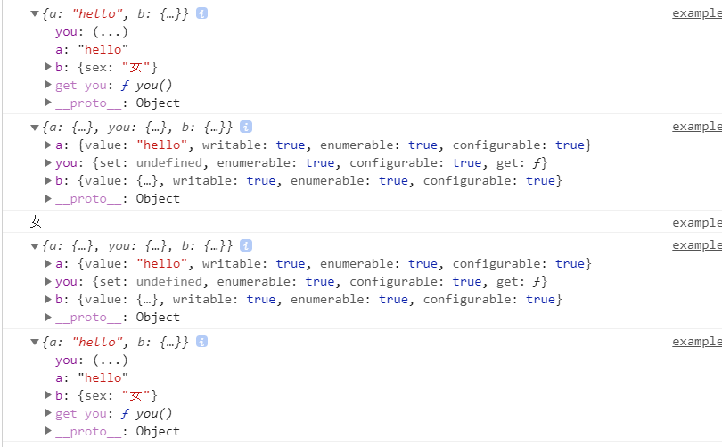

# 1. 对象的扩展

## 1.1 属性的简洁表示法

```js
// 1. 对象属性简写
// 1.1
const foo = 'bar';
const baz = {foo};
baz // {foo: "bar"}

// 等同于
const baz = {foo: foo};


// 1.2
function f(x, y) {
  return {x, y};
}

// 等同于

function f(x, y) {
  return {x: x, y: y};
}

f(1, 2) // Object {x: 1, y: 2}

// 2. 方法简写
const o = {
  method() {
    return "Hello!";
  }
};

// 等同于

const o = {
  method: function() {
    return "Hello!";
  }
};

// 3. 一个实际的例子
let birth = '2000/01/01';

const Person = {

  name: '张三',

  //等同于birth: birth
  birth,

  // 等同于hello: function ()...
  hello() { console.log('我的名字是', this.name); }

};

// 4. CommonJs模块导出一组变量将非常方便
let ms = {};

function getItem (key) {
  return key in ms ? ms[key] : null;
}

function setItem (key, value) {
  ms[key] = value;
}

function clear () {
  ms = {};
}

module.exports = { getItem, setItem, clear };
// 等同于
module.exports = {
  getItem: getItem,
  setItem: setItem,
  clear: clear
};
```

属性的赋值器（setter）和取值器（getter），事实上也是采用这种写法。

```js
const cart = {
  _wheels: 4,
  get wheels () {
    return this._wheels;
  },
  set wheels (value) {
    if (value < this._wheels) {
      throw new Error('数值太小了！');
    }
    this._wheels = value;
  }
}
cart.wheels = 20;
console.log(cart.wheels);
// 这里是为了取得这个属性的描述符（是一个访问器属性）
var des = Object.getOwnPropertyDescriptor(cart, 'wheels');
console.log(des); 

// 另一种写法 
const cart = {
  _wheels: 4,
};
Object.defineProperty(cart,'wheels',{
  configurable: true,
  enumerable: true,
  get: function () {
    return this._wheels
  },
  set: function (value) {
    if (value < this._wheels) {
      throw new Error('数值太小了！');
    }
    this._wheels = value;
  }
});
cart.wheels = 20;
console.log(cart.wheels);
var des = Object.getOwnPropertyDescriptor(cart, 'wheels');
console.log(des); 
```

注意，简写的对象方法不能用作构造函数，会报错。

```js
const obj = {
  f() {
    this.foo = 'bar';
  }
};

new obj.f() // 报错
```

## 1.2 属性名表达式

ES6 允许字面量定义对象时，用方法二（表达式）作为对象的属性名，即把表达式放在方括号内。

```js
let propKey = 'foo';

let obj = {
  [propKey]: true,
  ['a' + 'bc']: 123
};
```

```js
let lastWord = 'last word';

const a = {
  'first word': 'hello',
  [lastWord]: 'world'
};

a['first word'] // "hello"
a[lastWord] // "world"
a['last word'] // "world"
```

表达式还可以用于定义方法名。

```js
let obj = {
  ['h' + 'ello']() {
    return 'hi';
  }
};

obj.hello() // hi
```

注意，属性名表达式与简洁表示法，不能同时使用，会报错。

```js
// 报错
const foo = 'bar';
const bar = 'abc';
const baz = { [foo] };

// 正确
const foo = 'bar';
const baz = { [foo]: 'abc'};
```

## 1.3 方法的 name 属性

如果对象的方法使用了取值函数（`getter`）和存值函数（`setter`），则`name`属性不是在该方法上面，而是该方法的属性的描述对象的`get`和`set`属性上面，返回值是方法名前加上`get`和`set`。

```js
const obj = {
  get foo() {},
  set foo(x) {}
};

obj.foo.name
// TypeError: Cannot read property 'name' of undefined

const descriptor = Object.getOwnPropertyDescriptor(obj, 'foo');

descriptor.get.name // "get foo"
descriptor.set.name // "set foo"
```

有两种特殊情况：`bind`方法创造的函数，`name`属性返回`bound`加上原函数的名字；`Function`构造函数创造的函数，`name`属性返回`anonymous`。

```js
(new Function()).name // "anonymous"

var doSomething = function() {
  // ...
};
doSomething.bind().name // "bound doSomething"
```

如果对象的方法是一个 Symbol 值，那么`name`属性返回的是这个 Symbol 值的描述。

```js
const key1 = Symbol('description');
const key2 = Symbol();
let obj = {
  [key1]() {},
  [key2]() {},
};
obj[key1].name // "[description]"
obj[key2].name // ""
```

## 1.4 属性的可枚举性和遍历

- `for...in`循环：只遍历对象自身的和继承的可枚举的属性。
- `Object.keys()`：返回对象自身的所有可枚举的属性的键名。
- `JSON.stringify()`：只串行化对象自身的可枚举的属性。
- `Object.assign()`： 忽略`enumerable`为`false`的属性，只拷贝对象自身的可枚举的属性。

这四个操作之中，前三个是 ES5 就有的，最后一个`Object.assign()`是 ES6 新增的。其中，只有`for...in`会返回继承的属性，其他三个方法都会忽略继承的属性，只处理对象自身的属性。实际上，引入“可枚举”（`enumerable`）这个概念的最初目的，就是让某些属性可以规避掉`for...in`操作，不然所有内部属性和方法都会被遍历到。比如，对象原型的`toString`方法，以及数组的`length`属性，就通过“可枚举性”，从而避免被`for...in`遍历到。

```js
Object.getOwnPropertyDescriptor(Object.prototype, 'toString').enumerable
// false

Object.getOwnPropertyDescriptor([], 'length').enumerable
// false
```

另外，ES6 规定，所有 Class 的原型的方法都是不可枚举的。

```js
Object.getOwnPropertyDescriptor(class {foo() {}}.prototype, 'foo').enumerable
// false
// 下面这个例子看起来更明显一点
class Fuck {
    foo() {}
}
var fuck = new Fuck();
console.log(fuck);
console.log(Object.getOwnPropertyDescriptor(class {foo() {}}.prototype, 'foo').enumerable);
```

总的来说，操作中引入继承的属性会让问题复杂化，大多数时候，我们只关心对象自身的属性。所以，尽量不要用`for...in`循环，而用`Object.keys()`代替

ES6 一共有 5 种方法可以遍历对象的属性。

**（1）for...in**

`for...in`循环遍历对象自身的和继承的可枚举属性（不含 Symbol 属性）。

**（2）Object.keys(obj)**

`Object.keys`返回一个数组，包括对象自身的（不含继承的）所有可枚举属性（不含 Symbol 属性）的键名。

**（3）Object.getOwnPropertyNames(obj)**

`Object.getOwnPropertyNames`返回一个数组，包含对象自身的所有属性（不含 Symbol 属性，但是包括不可枚举属性）的键名。

**（4）Object.getOwnPropertySymbols(obj)**

`Object.getOwnPropertySymbols`返回一个数组，包含对象自身的所有 Symbol 属性的键名。

**（5）Reflect.ownKeys(obj)**

`Reflect.ownKeys`返回一个数组，包含对象自身的所有键名，不管键名是 Symbol 或字符串，也不管是否可枚举。

以上的 5 种方法遍历对象的键名，都遵守同样的属性遍历的次序规则。

- 首先遍历所有数值键，按照数值升序排列。
- 其次遍历所有字符串键，按照加入时间升序排列。
- 最后遍历所有 Symbol 键，按照加入时间升序排列。

```js
Reflect.ownKeys({ [Symbol()]:0, b:0, 10:0, 2:0, a:0 })
// ['2', '10', 'b', 'a', Symbol()]
```

## 1.5 super 关键字

我们知道，`this`关键字总是指向函数所在的当前对象，ES6 又新增了另一个类似的关键字`super`，指向当前对象的原型对象。

```js
const proto = {
  foo: 'hello'
};

const obj = {
  foo: 'world',
  find() {
    return super.foo;
  }
};

Object.setPrototypeOf(obj, proto);
obj.find() // "hello"
```

JavaScript 引擎内部，`super.foo`等同于`Object.getPrototypeOf(this).foo`（属性）或`Object.getPrototypeOf(this).foo.call(this)`（方法）。

```js
const proto = {
  x: 'hello',
  foo() {
    console.log(this.x);
  },
};

const obj = {
  x: 'world',
  foo() {
    super.foo();
  }
}

Object.setPrototypeOf(obj, proto);

obj.foo() // "world"
```

上面代码中，`super.foo`指向原型对象`proto`的`foo`方法，但是绑定的`this`却还是当前对象`obj`，因此输出的就是`world`。

## 1.6 对象的扩展运算符

### 1.6.1  解构赋值

对象的解构赋值用于从一个对象取值，相当于将目标对象自身的所有可遍历的（enumerable）、但尚未被读取的属性，分配到指定的对象上面。所有的键和它们的值，都会拷贝到新对象上面。

```js
let { x, y, ...z } = { x: 1, y: 2, a: 3, b: 4 };
x // 1
y // 2
z // { a: 3, b: 4 }
```

解构赋值必须是最后一个参数，否则会报错。

注意，解构赋值的拷贝是浅拷贝，即如果一个键的值是复合类型的值（数组、对象、函数）、那么解构赋值拷贝的是这个值的引用，而不是这个值的副本。

```js
let obj = { a: { b: 1 } };
let { ...x } = obj;
obj.a.b = 2;
x.a.b // 2
```

另外，扩展运算符的解构赋值，不能复制继承自原型对象的属性。

```js
let o1 = { a: 1 };
let o2 = { b: 2 };
o2.__proto__ = o1;
let { ...o3 } = o2;
o3 // { b: 2 }
o3.a // undefined
```

下面是另一个例子。

```js
const o = Object.create({ x: 1, y: 2 });
o.z = 3;

let { x, ...newObj } = o;
let { y, z } = newObj;
x // 1
y // undefined
z // 3
```

上面代码中，变量`x`是单纯的解构赋值，所以可以读取对象`o`继承的属性；变量`y`和`z`是扩展运算符的解构赋值，只能读取对象`o`自身的属性，所以变量`z`可以赋值成功，变量`y`取不到值。

### 1.6.2 扩展运算符

对象的扩展运算符（`...`）用于取出参数对象的所有可遍历属性，拷贝到当前对象之中。

```js
let z = { a: 3, b: 4 };
let n = { ...z };
n // { a: 3, b: 4 }
```

由于数组是特殊的对象，所以对象的扩展运算符也可以用于数组。

```js
let foo = { ...['a', 'b', 'c'] };
foo
// {0: "a", 1: "b", 2: "c"}
```

如果扩展运算符后面是一个空对象，则没有任何效果。

```js
{...{}, a: 1}
// { a: 1 }
```

如果扩展运算符后面不是对象，则会自动将其转为对象。

```js
// 等同于 {...Object(1)}
{...1} // {}

{...true} // {}

{...undefined} // {}

{...null} // {}
```

但是，如果扩展运算符后面是字符串，它会自动转成一个类似数组的对象，因此返回的不是空对象。

```js
{...'hello'}
// {0: "h", 1: "e", 2: "l", 3: "l", 4: "o"}
```

如果想完整克隆一个对象，还拷贝对象原型的属性，可以采用下面的写法。

```js
// 写法一
const clone1 = {
  __proto__: Object.getPrototypeOf(obj),
  ...obj
};

// 写法二
const clone2 = Object.assign(
  Object.create(Object.getPrototypeOf(obj)),
  obj
);

// 写法三
const clone3 = Object.create(
  Object.getPrototypeOf(obj),
  Object.getOwnPropertyDescriptors(obj)
)
```

扩展运算符可以用于合并两个对象。

```js
let a = {x:1,y:2};
let b = {x:3,z:4};
let ab = {...a,...b};
// 等同于
let ab = Object.assign({}, a, b);
console.log(ab);  // {x:3,y:2,z:4} ,注意会被覆盖
```

扩展运算符的参数对象之中，如果有取值函数`get`，这个函数是会执行的。

````js
let a = {
  get x() {
    throw new Error('not throw yet');
  }
}

let aWithXGetter = { ...a }; // 报错
````

上面例子中，取值函数`get`在扩展`a`对象时会自动执行，导致报错。

## 1.7 链判断运算符

```js
const firstName = message?.body?.user?.firstName || 'default';
const fooValue = myForm.querySelector('input[name=foo]')?.value
```

上面代码使用了`?.`运算符，直接在链式调用的时候判断，左侧的对象是否为`null`或`undefined`。如果是的，就不再往下运算，而是返回`undefined`。

链判断运算符有三种用法。

- `obj?.prop` // 对象属性
- `obj?.[expr]` // 同上
- `func?.(...args)` // 函数或对象方法的调用

下面是判断对象方法是否存在，如果存在就立即执行的例子。

```js
iterator.return?.()
```

下面是这个运算符常见的使用形式，以及不使用该运算符时的等价形式。

```js
a?.b
// 等同于
a == null ? undefined : a.b

a?.[x]
// 等同于
a == null ? undefined : a[x]

a?.b()
// 等同于
a == null ? undefined : a.b()

a?.()
// 等同于
a == null ? undefined : a()
```

## 1.8 Null 判断运算符

读取对象属性的时候，如果某个属性的值是`null`或`undefined`，有时候需要为它们指定默认值。常见做法是通过`||`运算符指定默认值。

```js
const headerText = response.settings.headerText || 'Hello, world!';
const animationDuration = response.settings.animationDuration || 300;
const showSplashScreen = response.settings.showSplashScreen || true;
```

上面的三行代码都通过`||`运算符指定默认值，但是这样写是错的。开发者的原意是，只要属性的值为`null`或`undefined`，默认值就会生效，但是属性的值如果为空字符串或`false`或`0`，默认值也会生效。

为了避免这种情况，[ES2020](https://github.com/tc39/proposal-nullish-coalescing) 引入了一个新的 Null 判断运算符`??`。它的行为类似`||`，但是只有运算符左侧的值为`null`或`undefined`时，才会返回右侧的值。

```js
const headerText = response.settings.headerText ?? 'Hello, world!';
const animationDuration = response.settings.animationDuration ?? 300;
const showSplashScreen = response.settings.showSplashScreen ?? true;
```

上面代码中，默认值只有在属性值为`null`或`undefined`时，才会生效。

这个运算符的一个目的，就是跟链判断运算符`?.`配合使用，为`null`或`undefined`的值设置默认值。

```js
const animationDuration = response.settings?.animationDuration ?? 300;
```

上面代码中，`response.settings`如果是`null`或`undefined`，就会返回默认值300。如果`response.settings`存在，但是`response.settings.animationDuration`为`undefined`或`null` 也会返回300

这个运算符很适合判断函数参数是否赋值。

```js
function Component(props) {
  const enable = props.enabled ?? true;
  // …
}
```

上面代码判断`props`参数的`enabled`属性是否赋值，等同于下面的写法。

```js
function Component(props) {
  const {
    enabled: enable = true,
  } = props;  // 这一句话的意思就是看props中是否有enabled属性，存在那么enable变量就等于他的值，若不存在则enable就为true
  // …
}
```

`??`有一个运算优先级问题，它与`&&`和`||`的优先级孰高孰低。现在的规则是，如果多个逻辑运算符一起使用，必须用括号表明优先级，否则会报错。

# 2. 对象的新增方法

## 2.1 `Object.is()`

ES6 提出“Same-value equality”（同值相等）算法，用来解决这个问题。`Object.is`就是部署这个算法的新方法。它用来比较两个值是否严格相等，与严格比较运算符（===）的行为基本一致(`NaN`不等于自身，以及`+0`等于`-0`。)。

```js
Object.is('foo', 'foo')
// true
Object.is({}, {}) // 两个堆空间地址不同的对象
// false

+0 === -0 //true
NaN === NaN // false

Object.is(+0, -0) // false
Object.is(NaN, NaN) // true
```


## 2.2 `Object.assign()`

`Object.assign`方法用于对象的合并，将源对象（source）的所有可枚举属性，复制到目标对象（target）。

```js
const target = { a: 1 };

const source1 = { b: 2 };
const source2 = { c: 3 };

Object.assign(target, source1, source2);
target // {a:1, b:2, c:3}
```

注意，如果目标对象与源对象有同名属性，或多个源对象有同名属性，则后面的属性会覆盖前面的属性。

```js
const target = { a: 1, b: 1 };

const source1 = { b: 2, c: 2 };
const source2 = { c: 3 };

Object.assign(target, source1, source2);
target // {a:1, b:2, c:3}
```

如果只有一个参数，`Object.assign`会直接返回该参数。

```js
const obj = {a: 1};
Object.assign(obj) === obj // true
```

如果该参数不是对象，则会先转成对象，然后返回。

```js
typeof Object.assign(2) // "object"
```

由于`undefined`和`null`无法转成对象，所以如果它们作为参数，就会报错。

```js
Object.assign(undefined) // 报错
Object.assign(null) // 报错
```

如果非对象参数出现在源对象的位置（即非首参数），那么处理规则有所不同。首先，这些参数都会转成对象，如果无法转成对象，就会跳过。这意味着，如果`undefined`和`null`不在首参数，就不会报错

```js
let obj = {a: 1};
Object.assign(obj, undefined) === obj // true
Object.assign(obj, null) === obj // true
```

其他类型的值（即数值、字符串和布尔值）不在首参数，也不会报错。但是，除了字符串会以数组形式，拷贝入目标对象，其他值都不会产生效果。

```js
const v1 = 'abc';
const v2 = true;
const v3 = 10;

const obj = Object.assign({}, v1, v2, v3);
console.log(obj); // { "0": "a", "1": "b", "2": "c" }
```

`Object.assign`拷贝的属性是有限制的，只拷贝源对象的自身属性（不拷贝继承属性），也不拷贝不可枚举的属性（`enumerable: false`）。

```js
Object.assign({b: 'c'},
  // 下面这个方法会返回对象，由于属性不可遍历，所以不会拷贝，而且这里可以不用写enumerable: false,因为默认就是false而且不会拷贝__proto__属性，因为这个属性指向Object.prototype（不可遍历）
  Object.defineProperty({}, 'invisible', {
    enumerable: false,
    value: 'hello'
  })
)
// { b: 'c' }

// 看这里
var obj = Object.defineProperty({}, 'invisible', {
    enumerable: false,
    value: 'hello'
});
console.log(obj.__proto__ === Object.prototype);

var des = Object.getOwnPropertyDescriptor(Object,'prototype');
console.log(des);
console.log(obj);
```

属性名为 Symbol 值的属性，也会被`Object.assign`拷贝。

```js
Object.assign({ a: 'b' }, { [Symbol('c')]: 'd' })
// { a: 'b', Symbol(c): 'd' }
```

==注意点==

**（1）浅拷贝**

`Object.assign`方法实行的是浅拷贝，而不是深拷贝。也就是说，如果源对象某个属性的值是对象，那么目标对象拷贝得到的是这个对象的引用。

```js
const obj1 = {a: {b: 1}};
const obj2 = Object.assign({}, obj1);

obj1.a.b = 2;
obj2.a.b // 2
```

**（2）同名属性的替换**

```js
const target = { a: { b: 'c', d: 'e' } }
const source = { a: { b: 'hello' } }
Object.assign(target, source)
// { a: { b: 'hello' } }
```

**（3）数组的处理**

`Object.assign`可以用来处理数组，但是会把数组视为对象。

```js
Object.assign([1, 2, 3], [4, 5])
// [4, 5, 3]
```

**（4）取值函数的处理**

```js
const source = {
  get foo() { return 1 }
};
const target = {};

Object.assign(target, source)
// { foo: 1 }
```

上面代码中，`source`对象的`foo`属性是一个取值函数，`Object.assign`不会复制这个取值函数，只会拿到值以后，将这个值复制过去。

==常见用途==

**（1）为对象添加属性**

```js
class Point {
  constructor(x, y) {
    Object.assign(this, {x, y});
  }
}
```

**（2）为对象添加方法**

```js
Object.assign(SomeClass.prototype, {
  someMethod(arg1, arg2) {
    ···
  },
  anotherMethod() {
    ···
  }
});

// 等同于下面的写法
SomeClass.prototype.someMethod = function (arg1, arg2) {
  ···
};
SomeClass.prototype.anotherMethod = function () {
  ···
};
```

**（3）克隆对象**

```js
function clone(origin) {
  return Object.assign({}, origin);
}
```

上面代码将原始对象拷贝到一个空对象，就得到了原始对象的克隆。

不过，采用这种方法克隆，只能克隆原始对象自身的值，不能克隆它继承的值。如果想要保持继承链，可以采用下面的代码。而且注意是浅拷贝，针对基本数据类型，对于引用数据类型，拷贝的是地址

```js
function clone(origin) {
  let originProto = Object.getPrototypeOf(origin);
  return Object.assign(Object.create(originProto), origin);
}
```

**（4）合并多个对象**

```js
const merge =
  (...sources) => Object.assign({}, ...sources);
```

**（5）为属性指定默认值**

```js
const DEFAULTS = {
  logLevel: 0,
  outputFormat: 'html'
};

function processContent(options) {
  options = Object.assign({}, DEFAULTS, options);
  console.log(options);
  // ...
}
```


## 2.3 `Object.getOwnPropertyDescriptors()`

ES5 的`Object.getOwnPropertyDescriptor()`方法会返回某个对象属性的描述对象（descriptor）。ES2017 引入了`Object.getOwnPropertyDescriptors()`方法，返回指定对象所有自身属性（非继承属性）的描述对象。

```js
const obj = {
  foo: 123,
  get bar() { return 'abc' }
};

Object.getOwnPropertyDescriptors(obj)
// { foo:
//    { value: 123,
//      writable: true,
//      enumerable: true,
//      configurable: true },
//   bar:
//    { get: [Function: get bar],
//      set: undefined,
//      enumerable: true,
//      configurable: true } }
```

该方法的引入目的，主要是为了解决`Object.assign()`无法正确拷贝`get`属性和`set`属性的问题。

```js
const source = {
  set foo(value) {
    console.log(value);
  }
};

const target2 = {};
Object.defineProperties(target2, Object.getOwnPropertyDescriptors(source));
Object.getOwnPropertyDescriptor(target2, 'foo')
// { get: undefined,
//   set: [Function: set foo],
//   enumerable: true,
//   configurable: true }
```

`Object.getOwnPropertyDescriptors()`方法的另一个用处，是配合`Object.create()`方法，将对象属性克隆到一个新对象。这属于浅拷贝。

```js
const clone = Object.create(Object.getPrototypeOf(obj),
  Object.getOwnPropertyDescriptors(obj));

// 或者

const shallowClone = (obj) => Object.create(
  Object.getPrototypeOf(obj),
  Object.getOwnPropertyDescriptors(obj)
);
```

`Object.getOwnPropertyDescriptors()`也可以用来实现 Mixin（混入）模式。

```js
// 要想掌握下面的代码，你需要了解Array.prototype.reduce函数（带有初始值），Object.create函数（两个参数），以及Object.getOwnPropertyDescriptors()函数（返回自身的所有属性以及对应的属性描述符）
let mix = (object) => ({
  with: (...mixins) => mixins.reduce(
    (c, mixin) => Object.create(
      c, Object.getOwnPropertyDescriptors(mixin)
    ), object)
});

// multiple mixins example
let a = {a: 'a'};
let b = {b: 'b'};
let c = {c: 'c'};
let d = mix(c).with(a, b);

d.c // "c"
d.b // "b"
d.a // "a"
```

```js
let fuck = {
  a: 'hello',
  get you() {
    return 'bitch';
  },
  b: {
    sex:'男'
  }
}
console.log(fuck);

var dess = Object.getOwnPropertyDescriptors(fuck);
console.log(dess);

var obj = Object.create(Object.getPrototypeOf(fuck),Object.getOwnPropertyDescriptors(fuck))
fuck.b.sex = '女'
console.log(obj.b.sex);

var dess2 = Object.getOwnPropertyDescriptors(obj);
console.log(dess2);

console.log(obj);

// 结果如下图
// 1. 浅拷贝(对于属性为对象，拷贝的是地址)
// 2. create函数返回的新对象的__proto__指向第一个参数，新对象的自身的属性都是第二个参数所指定（包括他的属性对应的描述符）
```



## 2.4 `__proto__属性，Object.setPrototypeOf()，Object.getPrototypeOf()`

## 2.5 `Object.keys()，Object.values()，Object.entries()`

### 2.5.1 Object.keys()

ES5 引入了`Object.keys`方法，返回一个数组，成员是参数对象自身的（不含继承的）所有可遍历（enumerable）属性的键名。

```js
var obj = { foo: 'bar', baz: 42 };
Object.keys(obj)
// ["foo", "baz"]
```

ES2017 [引入](https://github.com/tc39/proposal-object-values-entries)了跟`Object.keys`配套的`Object.values`和`Object.entries`，作为遍历一个对象的补充手段，供`for...of`循环使用。

`Object.values`方法返回一个数组，成员是参数对象自身的（不含继承的）所有可遍历（enumerable）属性的键值。

```js
const obj = { foo: 'bar', baz: 42 };
Object.values(obj)
// ["bar", 42]
```

`Object.values`只返回对象自身的可遍历属性。

```js
const obj = Object.create({}, {p: {value: 42}});
Object.values(obj) // []
```

上面代码中，`Object.create`方法的第二个参数添加的对象属性（属性`p`），如果不显式声明，默认是不可遍历的，因为`p`的属性描述对象的`enumerable`默认是`false`，`Object.values`不会返回这个属性。只要把`enumerable`改成`true`，`Object.values`就会返回属性`p`的值。

```js
const obj = Object.create({}, {p:
  {
    value: 42,
    enumerable: true
  }
});
Object.values(obj) // [42]
```

`Object.values`会过滤属性名为 Symbol 值的属性。

```js
Object.values({ [Symbol()]: 123, foo: 'abc' });
// ['abc']
```

如果`Object.values`方法的参数是一个字符串，会返回各个字符组成的一个数组。

```js
Object.values('foo')
// ['f', 'o', 'o']
```

如果参数不是对象，`Object.values`会先将其转为对象。由于数值和布尔值的包装对象，都不会为实例添加非继承的属性(意思就是说只会是添加继承的属性，而自身实例属性不会存在，所以结果为`[]`)。所以，`Object.values`会返回空数组。

```js
Object.values(42) // []
Object.values(true) // []
```

`Object.entries()`方法返回一个数组，成员是参数对象自身的（不含继承的）所有可遍历（enumerable）属性的键值对数组。

除了返回值不一样，该方法的行为与`Object.values`基本一致。

如果原对象的属性名是一个 Symbol 值，该属性会被忽略。

```js
Object.entries({ [Symbol()]: 123, foo: 'abc' });
// [ [ 'foo', 'abc' ] ]
```

自己实现`Object.entries`方法，非常简单。

```js
// Generator函数的版本 返回生成器
function* entries(obj) {
  for (let key of Object.keys(obj)) {
    yield [key, obj[key]];
  }
}

// 非Generator函数的版本，返回数组
function entries(obj) {
  let arr = [];
  for (let key of Object.keys(obj)) {
    arr.push([key, obj[key]]);
  }
  return arr;
}
```


## 2.6 `Object.fromEntries()`

`Object.fromEntries()`方法是`Object.entries()`的逆操作，用于将一个键值对数组转为对象。

```js
Object.fromEntries([
  ['foo', 'bar'],
  ['baz', 42]
])
// { foo: "bar", baz: 42 }
```

该方法的主要目的，是将键值对的数据结构还原为对象，因此特别适合将 Map 结构转为对象。

```js
// 例一
const entries = new Map([
  ['foo', 'bar'],
  ['baz', 42]
]);

Object.fromEntries(entries)
// { foo: "bar", baz: 42 }

// 例二
const map = new Map().set('foo', true).set('bar', false);
Object.fromEntries(map)
// { foo: true, bar: false }
```

该方法的一个用处是配合`URLSearchParams`对象，将查询字符串转为对象。

```js
Object.fromEntries(new URLSearchParams('foo=bar&baz=qux'))
// { foo: "bar", baz: "qux" }
```

# 3. `Set`和`Map`数据结构

## 3.1 `Set`

ES6 提供了新的数据结构 Set。它类似于数组，但是成员的值都是唯一的，没有重复的值。

`Set`本身是一个构造函数，用来生成 Set 数据结构。

```js
const s = new Set();

[2, 3, 5, 4, 5, 2, 2].forEach(x => s.add(x));

for (let i of s) {
  console.log(i);
}
// 2 3 5 4
```

`Set`函数可以接受一个数组（或者具有 iterable 接口的其他数据结构）作为参数，用来初始化。

```js
// 例一
const set = new Set([1, 2, 3, 4, 4]);
[...set]
// [1, 2, 3, 4]

// 例二
const items = new Set([1, 2, 3, 4, 5, 5, 5, 5]);
items.size // 5

// 例三
const set = new Set(document.querySelectorAll('div'));
set.size // 56

// 类似于
const set = new Set();
document
 .querySelectorAll('div')
 .forEach(div => set.add(div));
set.size // 56
```

```js
// 去除数组的重复成员
[...new Set(array)]
[...new Set('ababbc')].join('')
// "abc"
```

向 Set 加入值的时候，不会发生类型转换，所以`5`和`"5"`是两个不同的值。Set 内部判断两个值是否不同，使用的算法叫做“Same-value-zero equality”，它类似于精确相等运算符（`===`），主要的区别是向 Set 加入值时认为`NaN`等于自身，而精确相等运算符认为`NaN`不等于自身。

```js
let set = new Set();
let a = NaN;
let b = NaN;
set.add(a);
set.add(b);
set // Set {NaN}
```

另外，两个对象总是不相等的。

```js
let set = new Set();

set.add({});
set.size // 1

set.add({});
set.size // 2
```

### Set 实例的属性和方法 

Set 结构的实例有以下属性。

- `Set.prototype.constructor`：构造函数，默认就是`Set`函数。
- `Set.prototype.size`：返回`Set`实例的成员总数。

Set 实例的方法分为两大类：操作方法（用于操作数据）和遍历方法（用于遍历成员）。下面先介绍四个操作方法。

- `Set.prototype.add(value)`：添加某个值，返回 Set 结构本身。
- `Set.prototype.delete(value)`：删除某个值，返回一个布尔值，表示删除是否成功。
- `Set.prototype.has(value)`：返回一个布尔值，表示该值是否为`Set`的成员。
- `Set.prototype.clear()`：清除所有成员，没有返回值。

上面这些属性和方法的实例如下。

```js
s.add(1).add(2).add(2);
// 注意2被加入了两次

s.size // 2

s.has(1) // true
s.has(2) // true
s.has(3) // false

s.delete(2);
s.has(2) // false
```

`Array.from`方法可以将 Set 结构转为数组。

这就提供了去除数组重复成员的另一种方法。

```js
function dedupe(array) {
  return Array.from(new Set(array));
}

dedupe([1, 1, 2, 3]) // [1, 2, 3]
```

### 遍历操作

Set 结构的实例有四个遍历方法，可以用于遍历成员。

- `Set.prototype.keys()`：返回键名的遍历器
- `Set.prototype.values()`：返回键值的遍历器
- `Set.prototype.entries()`：返回键值对的遍历器
- `Set.prototype.forEach()`：使用回调函数遍历每个成员

需要特别指出的是，`Set`的遍历顺序就是插入顺序。这个特性有时非常有用，比如使用 Set 保存一个回调函数列表，调用时就能保证按照添加顺序调用。

**（1）`keys()`，`values()`，`entries()`**

`keys`方法、`values`方法、`entries`方法返回的都是遍历器对象（详见《Iterator 对象》一章）。由于 Set 结构没有键名，只有键值（或者说键名和键值是同一个值），所以`keys`方法和`values`方法的行为完全一致。

```js
let set = new Set(['red', 'green', 'blue']);

for (let item of set.keys()) {
  console.log(item);
}
// red
// green
// blue

for (let item of set.values()) {
  console.log(item);
}
// red
// green
// blue

for (let item of set.entries()) {
  console.log(item);
}
// ["red", "red"]
// ["green", "green"]
// ["blue", "blue"]
```

Set 结构的实例默认可遍历，它的默认遍历器生成函数就是它的`values`方法。

```js
Set.prototype[Symbol.iterator] === Set.prototype.values
// true
```

这意味着，可以省略`values`方法，直接用`for...of`循环遍历 Set。

```js
let set = new Set(['red', 'green', 'blue']);

for (let x of set) {
  console.log(x);
}
// red
// green
// blue
```

**（2）`forEach()`**

Set 结构的实例与数组一样，也拥有`forEach`方法，用于对每个成员执行某种操作，没有返回值。

```js
let set = new Set([1, 4, 9]);
set.forEach((value, key) => console.log(key + ' : ' + value))
// 1 : 1
// 4 : 4
// 9 : 9
```

上面代码说明，`forEach`方法的参数就是一个处理函数。该函数的参数与数组的`forEach`一致，依次为键值、键名、集合本身（上例省略了该参数）。这里需要注意，Set 结构的键名就是键值（两者是同一个值），因此第一个参数与第二个参数的值永远都是一样的。

另外，`forEach`方法还可以有第二个参数，表示绑定处理函数内部的`this`对象。

**（3）遍历的应用**

扩展运算符（`...`）内部使用`for...of`循环，所以也可以用于 Set 结构。

```js
let set = new Set(['red', 'green', 'blue']);
let arr = [...set];
// ['red', 'green', 'blue']
```

扩展运算符和 Set 结构相结合，就可以去除数组的重复成员。

```js
let arr = [3, 5, 2, 2, 5, 5];
let unique = [...new Set(arr)];
// [3, 5, 2]
```

而且，数组的`map`和`filter`方法也可以间接用于 Set 了。

```js
let set = new Set([1, 2, 3]);
set = new Set([...set].map(x => x * 2));
// 返回Set结构：{2, 4, 6}

let set = new Set([1, 2, 3, 4, 5]);
set = new Set([...set].filter(x => (x % 2) == 0));
// 返回Set结构：{2, 4}
```

因此使用 Set 可以很容易地实现并集（Union）、交集（Intersect）和差集（Difference）。

````js
let a = new Set([1, 2, 3]);
let b = new Set([4, 3, 2]);

// 并集
let union = new Set([...a, ...b]);
// Set {1, 2, 3, 4}

// 交集
let intersect = new Set([...a].filter(x => b.has(x)));
// set {2, 3}

// 差集
let difference = new Set([...a].filter(x => !b.has(x)));
// Set {1}
````

如果想在遍历操作中，同步改变原来的 Set 结构，目前没有直接的方法，但有两种变通方法。一种是利用原 Set 结构映射出一个新的结构，然后赋值给原来的 Set 结构；另一种是利用`Array.from`方法。

```js
// 方法一
let set = new Set([1, 2, 3]);
set = new Set([...set].map(val => val * 2));
// set的值是2, 4, 6

// 方法二
let set = new Set([1, 2, 3]);
set = new Set(Array.from(set, val => val * 2));
// set的值是2, 4, 6
```

## 3.2` WeakSet`

WeakSet 结构与 Set 类似，也是不重复的值的集合。但是，它与 Set 有两个区别。

首先，WeakSet 的成员只能是对象，而不能是其他类型的值。

其次，WeakSet 中的对象都是弱引用，即垃圾回收机制不考虑 WeakSet 对该对象的引用，也就是说，如果其他对象都不再引用该对象，那么垃圾回收机制会自动回收该对象所占用的内存，不考虑该对象还存在于 WeakSet 之中。

这是因为垃圾回收机制依赖引用计数，如果一个值的引用次数不为`0`，垃圾回收机制就不会释放这块内存。结束使用该值之后，有时会忘记取消引用，导致内存无法释放，进而可能会引发内存泄漏。WeakSet 里面的引用，都不计入垃圾回收机制，所以就不存在这个问题。因此，WeakSet 适合临时存放一组对象，以及存放跟对象绑定的信息。只要这些对象在外部消失，它在 WeakSet 里面的引用就会自动消失。

由于上面这个特点，WeakSet 的成员是不适合引用的，因为它会随时消失。另外，由于 WeakSet 内部有多少个成员，取决于垃圾回收机制有没有运行，运行前后很可能成员个数是不一样的，而垃圾回收机制何时运行是不可预测的，因此 ES6 规定 WeakSet 不可遍历。

这些特点同样适用于本章后面要介绍的 WeakMap 结构。

```js
const a = [[1, 2], [3, 4]];
const ws = new WeakSet(a);
// WeakSet {[1, 2], [3, 4]}
```

注意成员一定要是对象

WeakSet 结构有以下三个方法。

- **WeakSet.prototype.add(value)**：向 WeakSet 实例添加一个新成员。
- **WeakSet.prototype.delete(value)**：清除 WeakSet 实例的指定成员。
- **WeakSet.prototype.has(value)**：返回一个布尔值，表示某个值是否在 WeakSet 实例之中。

下面是一个例子。

```js
const ws = new WeakSet();
const obj = {};
const foo = {};

ws.add(window);
ws.add(obj);

ws.has(window); // true
ws.has(foo);    // false

ws.delete(window);
ws.has(window);    // false
```

WeakSet 不能遍历，是因为成员都是弱引用，随时可能消失，遍历机制无法保证成员的存在，很可能刚刚遍历结束，成员就取不到了。WeakSet 的一个用处，是储存 DOM 节点，而不用担心这些节点从文档移除时，会引发内存泄漏。

下面是 WeakSet 的另一个例子。

````js
const foos = new WeakSet()
class Foo {
  constructor() {
    foos.add(this)
  }
  method () {
    if (!foos.has(this)) {
      throw new TypeError('Foo.prototype.method 只能在Foo的实例上调用！');
    }
  }
}
````

上面代码保证了`Foo`的实例方法，只能在`Foo`的实例上调用。这里使用 WeakSet 的好处是，`foos`对实例的引用，不会被计入内存回收机制，所以删除实例的时候，不用考虑`foos`，也不会出现内存泄漏。

## 3.3 `Map`

JavaScript 的对象（Object），本质上是键值对的集合（Hash 结构），但是传统上只能用字符串当作键。这给它的使用带来了很大的限制。

为了解决这个问题，ES6 提供了 Map 数据结构。它类似于对象，也是键值对的集合，但是“键”的范围不限于字符串，各种类型的值（包括对象）都可以当作键。也就是说，Object 结构提供了“字符串—值”的对应，Map 结构提供了“值—值”的对应，是一种更完善的 Hash 结构实现。如果你需要“键值对”的数据结构，Map 比 Object 更合适。

```js
const m = new Map();
const o = {p: 'Hello World'};

m.set(o, 'content')
m.get(o) // "content"

m.has(o) // true
m.delete(o) // true
m.has(o) // false
```

作为构造函数，Map 也可以接受一个数组作为参数。该数组的成员是一个个表示键值对的数组。

```js
const map = new Map([
  ['name', '张三'],
  ['title', 'Author']
]);

map.size // 2
map.has('name') // true
map.get('name') // "张三"
map.has('title') // true
map.get('title') // "Author"
```

事实上，不仅仅是数组，任何具有 Iterator 接口、且每个成员都是一个双元素的数组的数据结构（详见《Iterator》一章）都可以当作`Map`构造函数的参数。这就是说，`Set`和`Map`都可以用来生成新的 Map。

```js
const set = new Set([
  ['foo', 1],
  ['bar', 2]
]);
const m1 = new Map(set);
m1.get('foo') // 1

const m2 = new Map([['baz', 3]]);
const m3 = new Map(m2);
m3.get('baz') // 3
```

如果对同一个键多次赋值，后面的值将覆盖前面的值。

```js
const map = new Map();

map
.set(1, 'aaa')
.set(1, 'bbb');

map.get(1) // "bbb"
```

注意，只有对同一个对象的引用，Map 结构才将其视为同一个键。这一点要非常小心。

```js
const map = new Map();

map.set(['a'], 555);
map.get(['a']) // undefined

// 改写
const a = ['a'];
const map = new Map();

map.set(a, 555);
map.get(a) // 555
```

同理，同样的值的两个实例，在 Map 结构中被视为两个键。

```js
const map = new Map();

const k1 = ['a'];
const k2 = ['a'];

map
.set(k1, 111)
.set(k2, 222);

map.get(k1) // 111
map.get(k2) // 222
```

由上可知，Map 的键实际上是跟内存地址绑定的，只要内存地址不一样，就视为两个键。这就解决了同名属性碰撞（clash）的问题，我们扩展别人的库的时候，如果使用对象作为键名，就不用担心自己的属性与原作者的属性同名。

如果 Map 的键是一个简单类型的值（数字、字符串、布尔值），则只要两个值严格相等，Map 将其视为一个键，比如`0`和`-0`就是一个键，布尔值`true`和字符串`true`则是两个不同的键。另外，`undefined`和`null`也是两个不同的键。虽然`NaN`不严格相等于自身，但 Map 将其视为同一个键。

````js
let map = new Map();

map.set(-0, 123);
map.get(+0) // 123

map.set(true, 1);
map.set('true', 2);
map.get(true) // 1

map.set(undefined, 3);
map.set(null, 4);
map.get(undefined) // 3

map.set(NaN, 123);
map.get(NaN) // 123
````

Map 结构的默认遍历器接口（`Symbol.iterator`属性），就是`entries`方法

```js
map[Symbol.iterator] === map.entries
// true
```

```js
const map = new Map([
  [1, 'one'],
  [2, 'two'],
  [3, 'three'],
]);

[...map.keys()]
// [1, 2, 3]

[...map.values()]
// ['one', 'two', 'three']

[...map.entries()]
// [[1,'one'], [2, 'two'], [3, 'three']]

[...map]
// [[1,'one'], [2, 'two'], [3, 'three']]
```

结合数组的`map`方法、`filter`方法，可以实现 Map 的遍历和过滤（Map 本身没有`map`和`filter`方法）。

```js
const map0 = new Map()
  .set(1, 'a')
  .set(2, 'b')
  .set(3, 'c');

const map1 = new Map(
  [...map0].filter(([k, v]) => k < 3)
);
// 产生 Map 结构 {1 => 'a', 2 => 'b'}

const map2 = new Map(
  [...map0].map(([k, v]) => [k * 2, '_' + v])
    );
// 产生 Map 结构 {2 => '_a', 4 => '_b', 6 => '_c'}
```

此外，Map 还有一个`forEach`方法，与数组的`forEach`方法类似，也可以实现遍历。

```javascript
map.forEach(function(value, key, map) {
  console.log("Key: %s, Value: %s", key, value);
});
```

`forEach`方法还可以接受第二个参数，用来绑定`this`。

```javascript
const reporter = {
  report: function(key, value) {
    console.log("Key: %s, Value: %s", key, value);
  }
};

map.forEach(function(value, key, map) {
  this.report(key, value);
}, reporter);
```

上面代码中，`forEach`方法的回调函数的`this`，就指向`reporter`。

## 3.4 `WeakMap`

`WeakMap`结构与`Map`结构类似，也是用于生成键值对的集合。

```javascript
// WeakMap 可以使用 set 方法添加成员
const wm1 = new WeakMap();
const key = {foo: 1};
wm1.set(key, 2);
wm1.get(key) // 2

// WeakMap 也可以接受一个数组，
// 作为构造函数的参数
const k1 = [1, 2, 3];
const k2 = [4, 5, 6];
const wm2 = new WeakMap([[k1, 'foo'], [k2, 'bar']]);
wm2.get(k2) // "bar"
```

`WeakMap`与`Map`的区别有两点。

首先，`WeakMap`只接受对象作为键名（`null`除外），不接受其他类型的值作为键名。

基本上，如果你要往对象上添加数据，又不想干扰垃圾回收机制，就可以使用 WeakMap。一个典型应用场景是，在网页的 DOM 元素上添加数据，就可以使用`WeakMap`结构。当该 DOM 元素被清除，其所对应的`WeakMap`记录就会自动被移除。

```javascript
const wm = new WeakMap();

const element = document.getElementById('example');

wm.set(element, 'some information');
wm.get(element) // "some information"
```

上面代码中，先新建一个 Weakmap 实例。然后，将一个 DOM 节点作为键名存入该实例，并将一些附加信息作为键值，一起存放在 WeakMap 里面。这时，WeakMap 里面对`element`的引用就是弱引用，不会被计入垃圾回收机制。

也就是说，上面的 DOM 节点对象的引用计数是`1`，而不是`2`。这时，一旦消除对该节点的引用，它占用的内存就会被垃圾回收机制释放。Weakmap 保存的这个键值对，也会自动消失。

总之，`WeakMap`的专用场合就是，它的键所对应的对象，可能会在将来消失。`WeakMap`结构有助于防止内存泄漏。

WeakMap 的另一个用处是部署私有属性。

```js
const _counter = new WeakMap();
const _action = new WeakMap();

class Countdown {
  constructor(counter, action) {
    _counter.set(this, counter);
    _action.set(this, action);
  }
  dec() {
    let counter = _counter.get(this);
    if (counter < 1) return;
    counter--;
    _counter.set(this, counter);
    if (counter === 0) {
      _action.get(this)();
    }
  }
}

const c = new Countdown(2, () => console.log('DONE'));

c.dec()
c.dec()
// DONE
```

上面代码中，`Countdown`类的两个内部属性`_counter`和`_action`，是实例的弱引用，所以如果删除实例，它们也就随之消失，不会造成内存泄漏。

[<prev](./Day2.md) [next>](./Day4.md)
